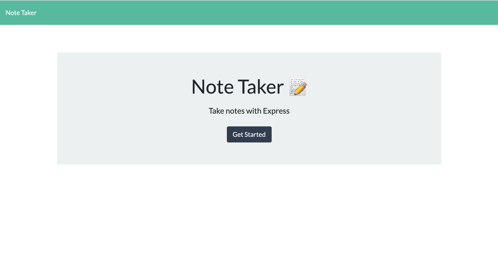

# Note Taker App

 

## Description

Note Taker can be used to write and save notes. The app uses an Express.js back end and will save and retrieve user generated note data from a JSON file.

The application’s front end has already been created. It's my job to build the back end, connect the two, and then deploy the finished application to Heroku.

## Installation

node js/ npm packages such as inquirer and express

## Usage

GIVEN a note-taking application
WHEN I open the Note Taker
THEN I am presented with a landing page with a link to a notes page
WHEN I click on the link to the notes page
THEN I am presented with a page with existing notes listed in the left-hand column, plus empty fields to enter a new note title and the note’s text in the right-hand column
WHEN I enter a new note title and the note’s text
THEN a Save icon appears in the navigation at the top of the page
WHEN I click on the Save icon
THEN the new note I have entered is saved and appears in the left-hand column with the other existing notes
WHEN I click on an existing note in the list in the left-hand column
THEN that note appears in the right-hand column
WHEN I click on the Write icon in the navigation at the top of the page
THEN I am presented with empty fields to enter a new note title and the note’s text in the right-hand column

## Links

https://note-taker-mattyjtx.herokuapp.com/

## License

## Screenshots

 

 

## Contributing

matthew gonzales

## Username

@mattyjtx

## Email

mattgonzales3@yahoo.com